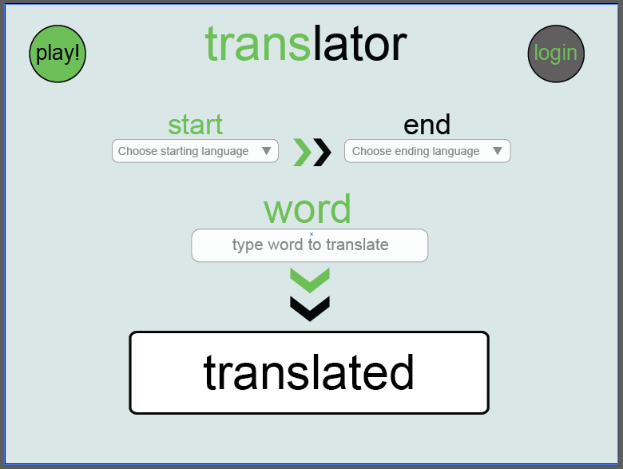
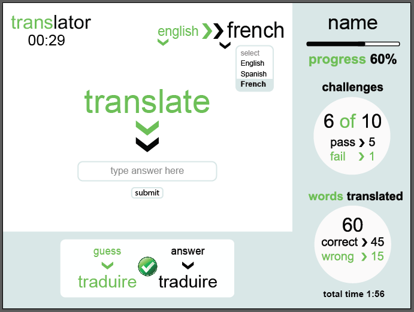
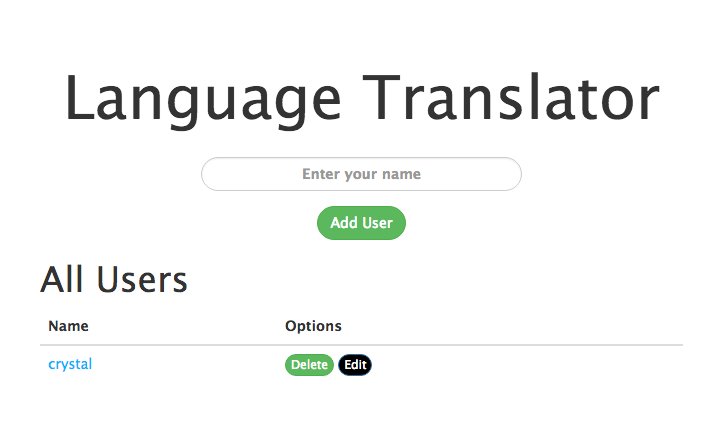
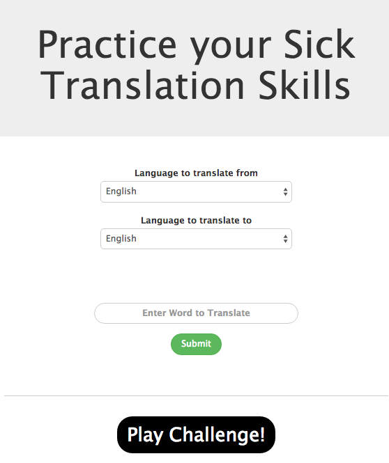
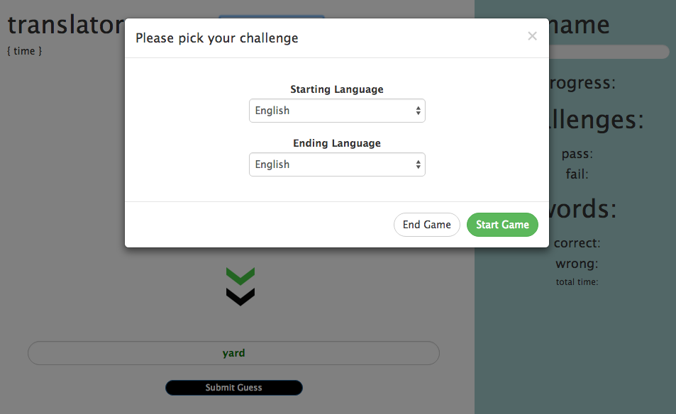
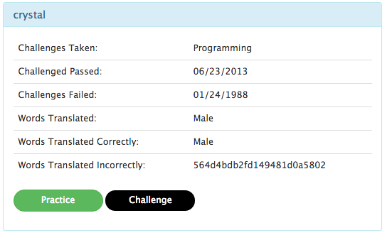

# Translator-Node Group Project

## Description

A fun translator tool that uses helps users learn new languages and take challenges and track their progress.

## Technologies
- HTML5 & CSS3
- JavaScript / jQuery
- Bing API
- NodeJs / Express
- Swig
- Gulp
- MongoDB
- User Authentication
 -Bootstrap

###Below is a mock up created with Adobe Illustrator
**Main Page**                       |    | **Challenge Page**
:----------------------------------:|:--:|:----------------------------------:
                 |    | 

###Below is a how the app looks currently
**Main Page**                       |    | **Practice Page**
:----------------------------------:|:--:|:----------------------------------:
             |    | 

**Modal on Challenge Page**         |    | **Stats Page**
:----------------------------------:|:--:|:----------------------------------:
            |    | 

!**[Challenge Page]**(translator_Home.png)

